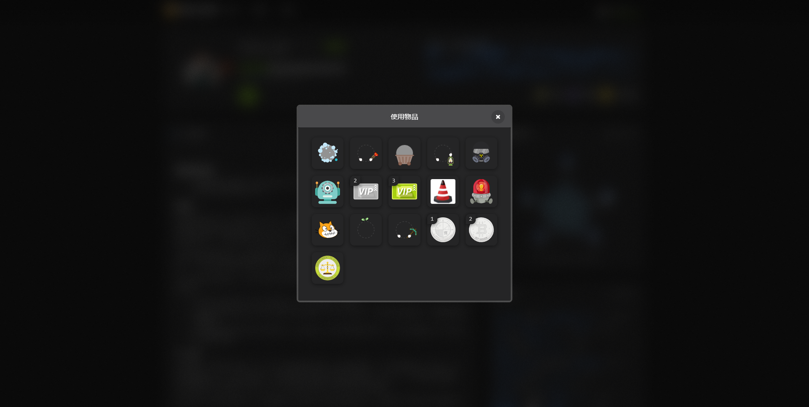

<h1 align=center style="">
    Aerfaying
    Theme Manager
    

    By SteveXMH
    

</h1>

A tool to modify the theme of the aerfaying/gitblock community website.

Currently in development, only support partal dark theme.

## Installation

You need to install a user script loader like Tampermonkey or Greasymonkey, then [Install userscript here](https://raw.githubusercontent.com/Steve-xmh/aerfaying-theme-manager/master/aerfaying-theme-manager.user.js)

If you have trouble in accessing raw github content, you can try [Fastgit Mirror](https://raw.fastgit.org/Steve-xmh/aerfaying-theme-manager/master/aerfaying-theme-manager.user.js)
