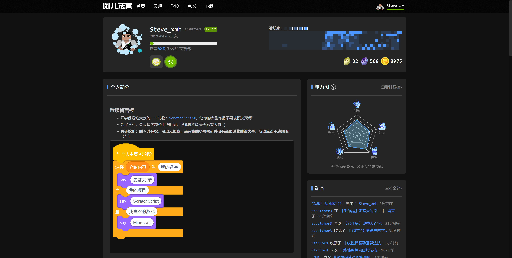

<h1 align=center style="">
    Aerfaying
    Theme Manager
    

    By SteveXMH
    

</h1>

A tool to modify the theme of the aerfaying community website.

Currently in development, only support partal dark theme.

[Install userscript here](https://raw.githubusercontent.com/Steve-xmh/aerfaying-theme-manager/master/aerfaying-theme-manager.user.js)
